# 🧠 Brain Tumor AI — Full-Stack MRI Classification & Explainable AI

  
  
  
  
  

  <strong>A complete end-to-end AI application for brain MRI classification, explainable predictions, authentication, containerization, and cloud deployment.</strong>

---

## 📌 Overview

A full-stack AI platform for **multi-class brain tumor classification from MRI scans**.

The system combines:

* 🧠 **TensorFlow/Keras CNN** for MRI classification
* 🔍 **LIME Explainable AI (XAI)** for model interpretability
* ⚡ **FastAPI REST backend**
* 🎨 **Nginx-served frontend**
* 🔐 **SQLAlchemy-based authentication**
* 🗄️ **Persistent SQLite database**
* 🐳 **Docker & Docker Compose**
* 📦 **Docker Hub image distribution**
* ☁️ **AWS EC2 cloud deployment**

---

## 💡 Quick Overview

| 🏷️ Domain               | 🚀 Key Highlights                                                                                   |
| :----------------------- | :-------------------------------------------------------------------------------------------------- |
| 🧠 **Machine Learning**  | Custom CNN, data augmentation, multi-class Softmax classification                                   |
| 🔍 **Explainable AI**    | LIME-based region-of-interest heatmaps                                                              |
| ⚡ **Backend & Database** | FastAPI REST API, OpenAPI/Swagger, SQLAlchemy ORM, SQLite                                           |
| 🎨 **Frontend UI**       | Responsive Vanilla JS dashboard, real-time image preview, probability visualization, authentication |
| 🐳 **DevOps & Cloud**    | Docker multi-container architecture, Docker Hub, AWS EC2                                            |

### 🎯 Supported Classes

* 🧠 Glioma
* 🧠 Meningioma
* 🧠 Pituitary
* 🟢 No Tumor

---

# 🏗️ System Architecture

The application follows a **Frontend → API → AI Inference → Database / Explainability** architecture.

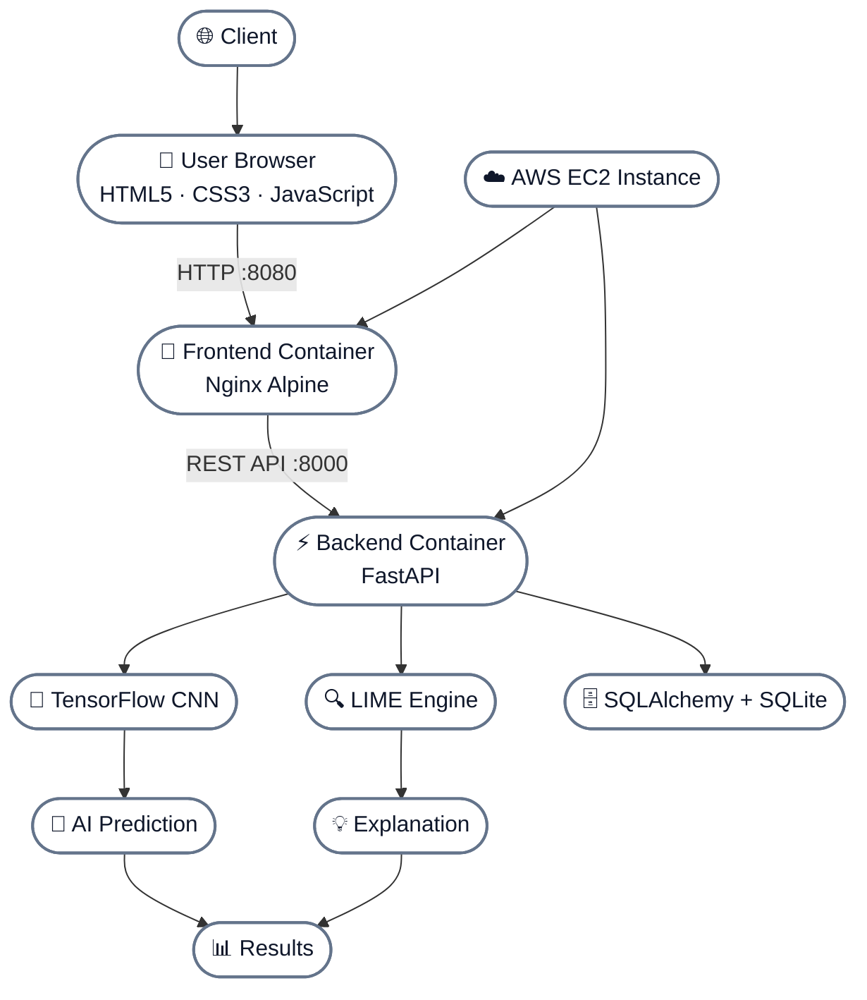

---

# 🔄 Application Workflow

The application follows an end-to-end workflow from authentication to MRI classification and explainable prediction.

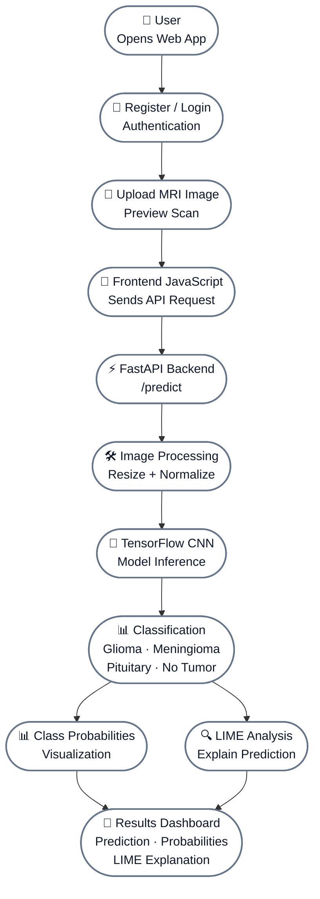

---

# 🧠 Machine Learning Pipeline

The application uses a **TensorFlow/Keras CNN** to classify brain MRI scans into four categories:

**Glioma · Meningioma · Pituitary · No Tumor**

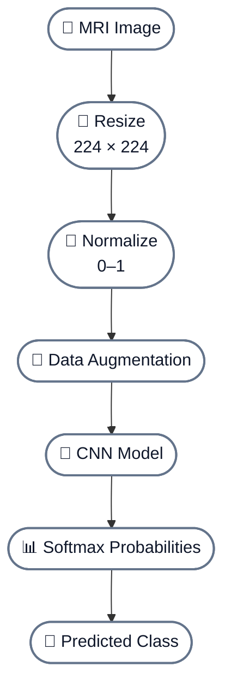

---

# 🔍 Explainable AI — LIME

To improve model interpretability, the application integrates **LIME (Local Interpretable Model-Agnostic Explanations)**.

After generating a prediction, the system analyzes the MRI image and identifies regions that contributed most to the model's decision.

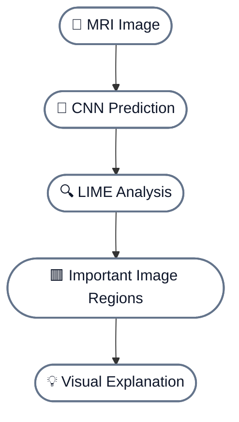

### ✨ Explainability Flow

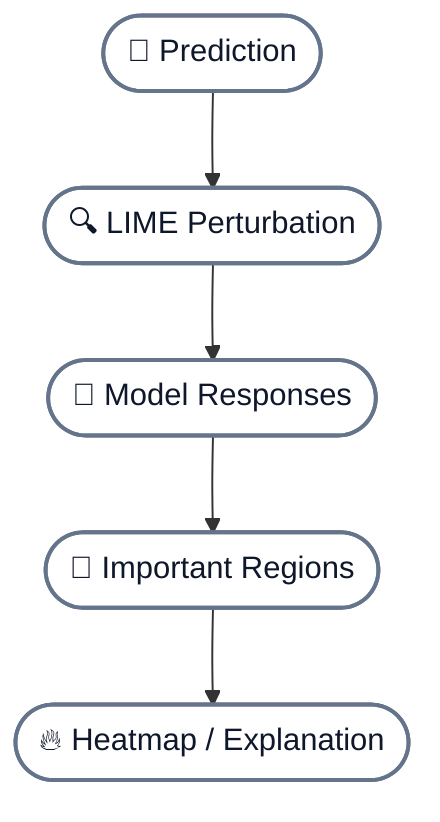

---

# ⚡ FastAPI Backend

The application uses **FastAPI** to provide a lightweight REST API for authentication, MRI prediction, and explainable AI.

## 🔌 API Endpoints

| Method | Endpoint    | Description                              |
| :----: | :---------- | :--------------------------------------- |
|  `GET` | `/`         | 🩺 API health/status check               |
| `POST` | `/register` | 👤 Register a new user                   |
| `POST` | `/login`    | 🔐 Authenticate an existing user         |
| `POST` | `/predict`  | 🧠 Classify a brain MRI image            |
| `POST` | `/explain`  | 🔍 Generate a LIME explanation           |
|  `GET` | `/docs`     | 📚 Interactive Swagger API documentation |

## 🛠️ Backend Responsibilities

* 👤 User registration and authentication
* 📤 MRI image upload handling
* 🧠 Brain tumor classification using the trained CNN
* 📊 Prediction probability generation
* 🔍 LIME-based visual explanations
* 🗄️ SQLite database integration using SQLAlchemy
* 🔌 REST API communication with the frontend

FastAPI's built-in **Swagger UI** makes it easy to test and explore the available endpoints during development and deployment.

---

# 🔐 Database & Authentication

The application includes a user authentication system backed by **SQLite** and **SQLAlchemy**.

## 🔄 Authentication Flow

### 👤 Registration

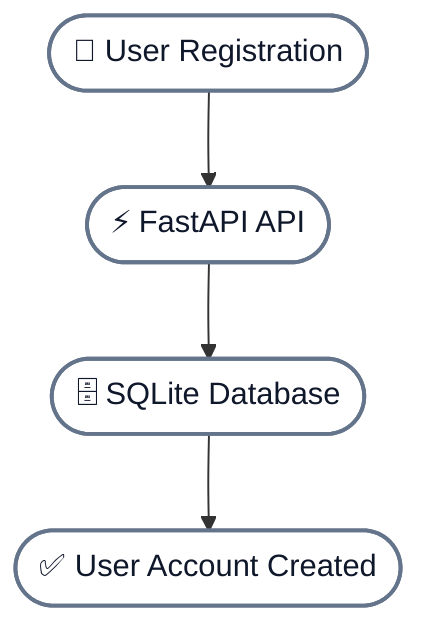

### 🔑 Login

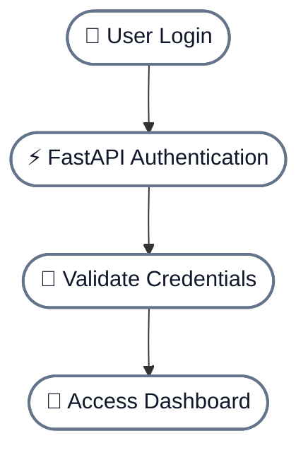

---

# 🎨 Frontend

The frontend provides the user-facing interface for authentication, MRI image upload, prediction results, and explainable AI visualization.

## ✨ Features

* 👤 User registration and login
* 🧠 Brain MRI image upload
* ⚡ Real-time communication with the FastAPI backend
* 📊 Predicted tumor class and probability display
* 🔍 LIME explanation visualization
* 🎯 Dashboard-based user experience
* 📱 Responsive interface using HTML and CSS

## 💻 Technology

| Technology     | Purpose                      |
| :------------- | :--------------------------- |
| **HTML5**      | 🧱 Page structure            |
| **CSS3**       | 🎨 Styling and responsive UI |
| **JavaScript** | ⚡ Client-side functionality  |
| **Nginx**      | 🌐 Frontend web server       |

The frontend dynamically determines the backend API host from the current browser hostname, allowing the same frontend build to work across local Docker and AWS EC2 deployments.

---

# 🐳 Docker Architecture

The application is containerized using **Docker**, with separate containers for the backend API and frontend web server.

## 📦 Container Architecture

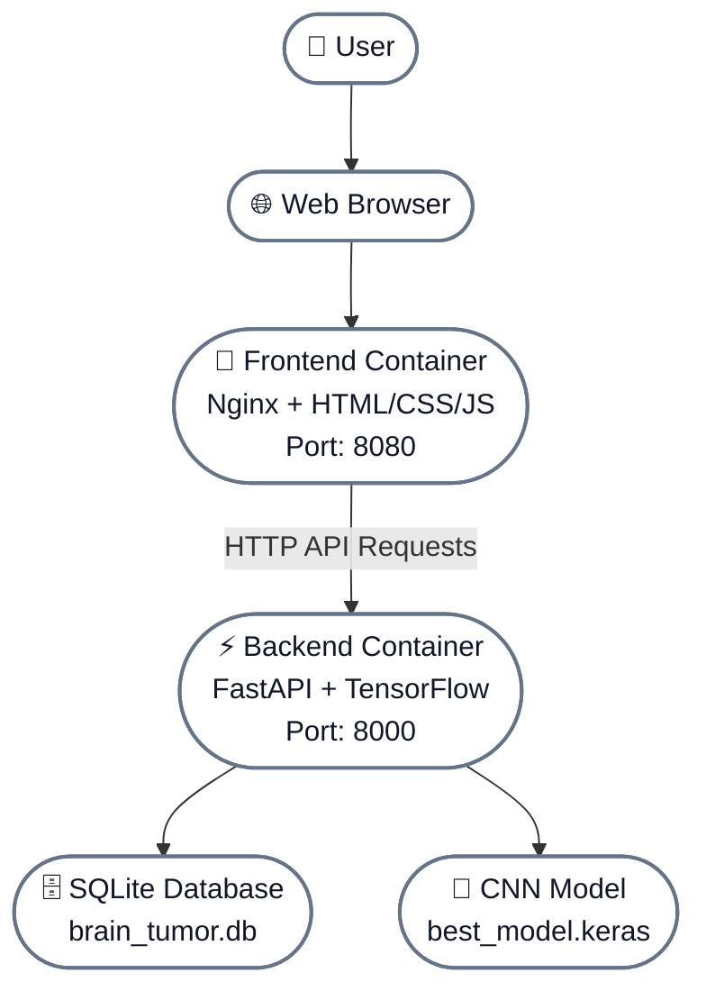

---

# 📦 Docker Hub

The containerized application is published to **Docker Hub** so the deployment environment can pull pre-built images without rebuilding the application on the server.

## 🔄 Image Workflow

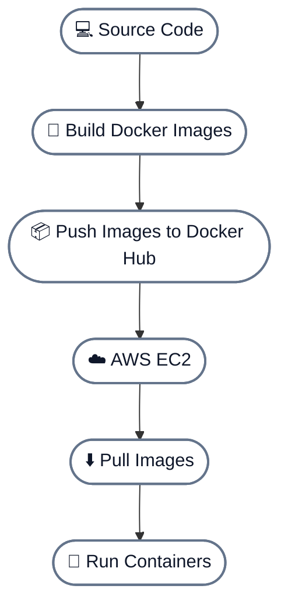

---

# ☁️ AWS EC2 Deployment

The application is deployed on **Amazon EC2** using Docker containers.

## 🖥️ Deployment Environment

| Configuration           | Value                 |
| :---------------------- | :-------------------- |
| ☁️ **Cloud Provider**   | AWS                   |
| 🖥️ **Service**         | Amazon EC2            |
| 🐧 **Operating System** | Ubuntu Server         |
| ⚙️ **Instance Type**    | `t3.small`            |
| 🏗️ **Architecture**    | x86_64                |
| 💾 **Storage**          | 20 GiB gp3            |
| 🌏 **Region**           | Asia Pacific (Mumbai) |

## 🏗️ Deployment Architecture

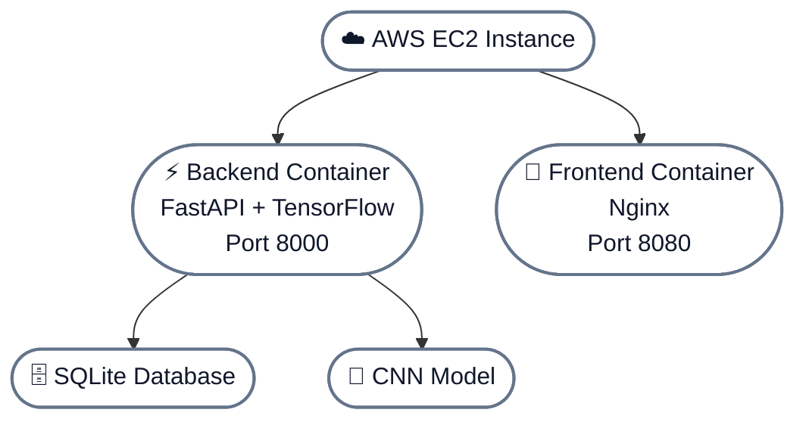

---

# 📈 Project Evolution

The project evolved from a standalone CNN-based classification model into a complete full-stack AI application.

## 🔄 Evolution Timeline

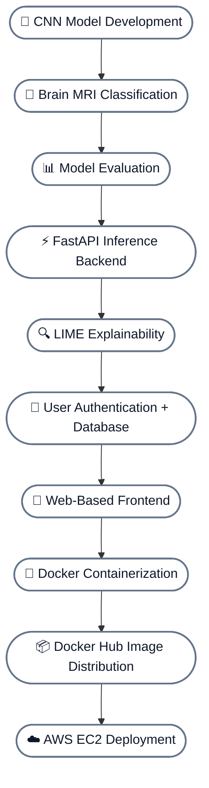

---

# 🛠️ Engineering Highlights

This project demonstrates practical **software engineering, machine learning, and cloud deployment skills** alongside the core AI model.

## 🔧 Key Engineering Practices

| Area                       | Implementation                                          |
| :------------------------- | :------------------------------------------------------ |
| ⚡ **Backend**              | RESTful API using FastAPI                               |
| 🧠 **AI Inference**        | TensorFlow/Keras CNN                                    |
| 🔍 **Explainability**      | LIME-based visual explanations                          |
| 🗄️ **Database**           | SQLite + SQLAlchemy                                     |
| 🎨 **Frontend**            | Separate frontend/backend architecture                  |
| 🐳 **Containerization**    | Docker                                                  |
| 🔄 **Orchestration**       | Docker Compose                                          |
| 📦 **Distribution**        | Docker Hub                                              |
| ☁️ **Deployment**          | AWS EC2                                                 |
| 🔐 **Networking**          | AWS Security Groups                                     |
| 💾 **Persistence**         | SQLite database persisted outside backend container     |
| 🛡️ **Repository Hygiene** | `.gitignore` and `.dockerignore`                        |
| 🔬 **ML Integration**      | Original ML work extended into a deployable application |

---

# 🎯 Project Purpose

This project was developed to explore how a **machine learning model can be transformed into a complete, deployable AI application**.

Rather than stopping at model training and evaluation, the project combines:

| Component                   | Technology                     |
| :-------------------------- | :----------------------------- |
| 🧠 **Machine Learning**     | CNN-based MRI classification   |
| 🔍 **Explainable AI**       | LIME-based visual explanations |
| ⚡ **Backend Development**   | FastAPI REST API               |
| 🎨 **Frontend Development** | HTML, CSS, JavaScript          |
| 🔐 **Authentication**       | User registration and login    |
| 🗄️ **Database**            | SQLite with SQLAlchemy         |
| 🐳 **Containerization**     | Docker & Docker Compose        |
| 📦 **Image Distribution**   | Docker Hub                     |
| ☁️ **Cloud Deployment**     | AWS EC2                        |

---

## 🚀 End-to-End Journey

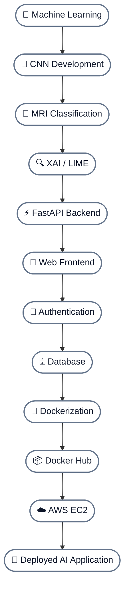

---

## ⭐ Project Stack

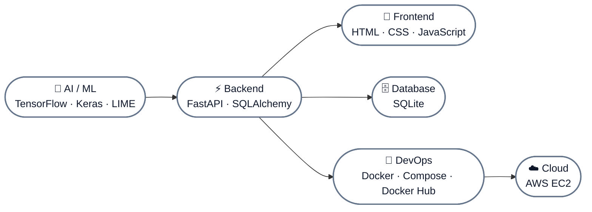

---

## 📌 Final Architecture

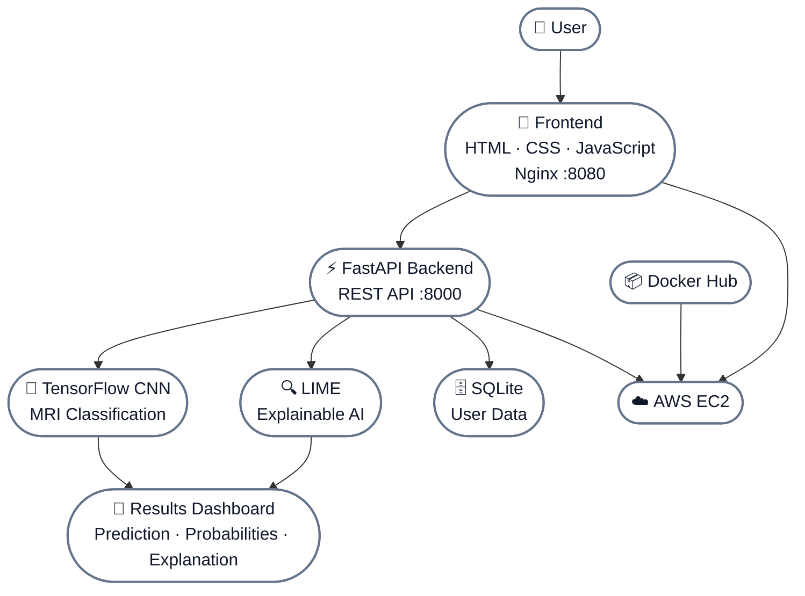

---

  <strong>🧠 From MRI Classification → Explainable AI → Full-Stack Application → Docker → AWS 🚀</strong>

---

# 👨‍💻 Team

## Developers

* **Sourja Goswamy**
* **Soumik Chowdhury**
